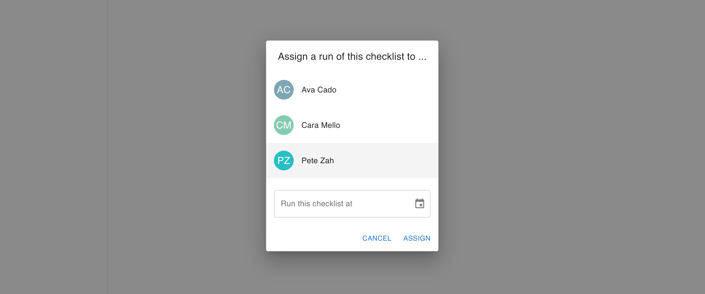

# Checklist App Project

As part of the recruitment process for developers at Loaded we like to have a
small project that can be given to candidates. This project is designed to
allow you to showcase your skills and demonstrate your ability to work on an
application that is similar to the real world application we are building.

We follow up your submission with a video call where you can tell us about
what you've done and what you think can be improved in the existing code.

## Process

Start off by reading the [Overview](#overview) section below, this explains
what the example application this repository contains is all about and what
currently works.

Then read the [Technical Setup](#technical-setup) section to get the project
running on your machine.

Once you've got the application running, have a go at implementing some of the
work describe in the [Desired Functionality](#desired-functionality) section.

Finally, read the [Submission Process](#submission-process) section to submit
your work to us so we can schedule the follow up video call.

# Overview

The Checklist App is a partially completed project that needs a few things
added to it in order to be useful. Adding these features will require you
to be comfortable with getting an unfamiliar application up and running, as
well as knowing about the following technologies so you can understand how the
app works:

- ASP.NET Core
- Entity Framework Core
- React + popular frontend libraries

The application works today. What we'd like you to do is work on the features
in the 'Desired Functionality' section below, seeing how far you can get in
no more than 3-4 hours of work.

Once you've added the features and submitted them to us we'll schedule a follow
up video call to discuss the work you've done. During this call we're keen to
hear how you've approached the changes, and what and why you've changed anything
(or think could be improved, but didn't do due to keeping to the time constraint).

If you run into any issues that are preventing you from getting a feature
working then feel free to use options like mocking or hard-coding a response
so that you can move forward. UI changes don't need to be pixel perfect, etc.
There isn't a right or wrong answer here - it's common for us to discuss
hypothetical changes with candidates they think would be good improvements during
the follow up video call - we like those conversations!

We don't want this project to be onerous. The follow up conversation we'll have
together discussing your own changes, and what you think can be improved in
the existing code, is the interesting part for us.

_Note: this app isn't supposed to be perfect, instead it's supposed to reflect
a real world codebase. You're welcome to make changes to the code to make it
better, but don't feel like you need to spend too much time on it. For things
you haven't changed, but think aren't ideal, keep a note of how you think things
can be made better, and then we can discuss it during the video call._

## What is the Checklist App intended to be used for?

Imagine you are running a kitchen in a restaurant that runs 24hrs a day, you're
not going to be at work all the time, but you need to make sure that particular
tasks get done. It's quite likely that these tasks need to be repeated each day.

The Checklist App is designed to help you with this by allowing you to create 
checklists that contain a list of tasks that need to be done. It also allows you
to assign a checklist 'run' to a team member. A checklist run is when the team
member completes the tasks in the checklist and records that they have done so.

The app allows you to view the checklist runs that have been assigned to team
members, both those that are pending and those that have been completed. You can
imagine how this can be used to keep track of what has been happening in the
kitchen. The ultimate end-goal is to allow the team to record notes alongside
each task in the checklist run (although that's not in scope for this project).

## Current Functionality

The Checklist App has already had some features implemented. Once you've got
the app running play around with the features described below. These features
illustrate ways of doing everything we need in terms of user interactions, making
API calls, and storing data. They should hopefully be a good guide for adding
more features to the app.

### Checklists
- Viewing checklists 
  - The default view when you first load the app shows all currently available
    checklists.
    
  - Clicking the 'View' button on a checklist will show you the details of that
    checklist, including the set of individual tasks that need to be done.
    
  - Clicking the 'Assign' button on a checklist will allow you to see a list of
    team members that can be assigned to a run of that checklist, and chose a
    date and time for the run to be performed.
    
    _Note that this currently doesn't do anything other than log to the console
    the details of which checklist, team member, and datetime was selected._
- Editing a checklist
  - Once you're viewing the checklist you can choose to edit it. This allows you
    to change all details, including adding more tasks to the checklist.
    
- Deleting a checklist
  - Once you're editing a checklist you have the option to delete it too.
    
- Creating a checklist
  - Click the 'New checklist' button in the bottom right corner of the screen
    to create a new checklist.
    

### Pending Checklist Runs
- Viewing pending checklist runs
  - Clicking the 'Pending' menu item currently shows a placeholder page.
    

### Completed Checklist Runs
- Viewing completed checklist runs
  - Clicking the 'Completed' menu item shows a table of hard-coded example
    checklist runs. This provides an example of a table that we want to update
    to have 'real' data coming from the API.
    

### Team Members
- Viewing team members
  - Clicking on the 'Team' menu item will show you a list of all team members.
    
  - Clicking the 'View' button on a team member will show you the details of that
    team member.
    
  
- Editing a team member
  - Clicking on the 'Edit' button on a team member will allow you to edit that
    team member's details.
    
- Deleting a team member
  - Once you're editing a team member you have the option to delete it too.
    

# Technical Setup

There are two parts to the Checklist App:

1. The API service, which is a ASP.NET Core Web API project that uses Entity
   Framework Core to interact with a SQLite database.
2. The UI application, which is a React + TypeScript + Vite project.

You'll need to get these running on your own machine. Follow step 1. of the
[Submission Process](#submission-process) section below to create your own copy
of the repository, and the clone that newly created repository to your own
machine.

Once you've got the repository on your own machine there are two services that
need to be running. See the individual README files linked below for details.

## API Service

The API service is located in the [`Api`](Api) folder. You can find more
information about the API service in the [`Api/README.md`](Api/README.md) file.

## UI Application

The UI application is located in the [`ui`](ui) folder. You can find more
information about the UI application in the [`ui/README.md`](ui/README.md) file.

## Notes

This project has been developed using Jetbrains Rider (backend), it also quite
happily runs in VS Code with the Microsoft C# extension installed. The project
has also been tested to build and run manually using the `dotnet` CLI tool.

# Desired Functionality

The next feature we want to add to this app is the ability to assign a checklist
to a team member, so they can complete the tasks in the checklist. We will call
this a 'checklist run'.

## Assigning a new checklist run to a team member
- We want to finish the checklist assignment process. The things that need to
  be done are:
  - In the assignment dialog once the 'Assign' button is clicked we want to:
    - Send an API call to record the checklist run assignment.
  - On the API service we need to have changes made so that:
    - We can record the assignment of a checklist run to a team member.
    - There is a way of getting a list of all checklist runs that have been
      assigned to team members, including the date time that the checklist run
      should be performed at (i.e. the value chosen by the user in the dialog).
    - This information should be stored in the database.

## Viewing pending checklist runs
- We also want to be able to view a list of all the checklist runs that have
  been assigned to team members. The things that need to be done are:
  - Clicking the 'Pending' menu item will show a table of all checklist runs that have
    been assigned to team members, which aren't yet completed.
    - There is no limit on the number of checklist runs that can be assigned to a
      single team member at any one time.
    - There are four columns in the table:
      - The name of the checklist to be followed.
      - The name of the team member that is assigned to the checklist run.
      - The date time that the checklist run should be performed.
      - A button with the text 'Start checklist'
    
  - Clicking the 'Start checklist' button on a row will, for now, just send an
    API call to update the checklist run to say it has been completed.
    - The completion time should be recorded as the time the API call is made.
    - The checklist run should be marked as completed in the database.
    - The checklist run should be removed from the 'Pending' table.

_Note: if you run into any blocking issues while implementing these features, or
they are taking too long, don't worry! Feel free to use alternative approaches or
park the changes in favour of discussing things in the video call - we know that
in the real world you'll have team mates to discuss things with._

# Submission Process

This repository is setup as a GitHub template repository. This means that you can
create a private copy of this repository to make your changes on. Once you're
happy, you can then share your version of the code with developers@loadedhub.com
so we can take a look. Follow the steps below to get set up.

### 1. Create your own version of the Checklist App

In the top right corner of this page you'll see a button that says 'Use this
template'. Click that button and then follow the instructions to create a copy
of this repository in your own GitHub account.

Please make sure to create a *private* copy of the repository so that your
changes aren't visible to other candidates!

### 2. Make your changes

We'd like you to spend no more than 3-4 hours on making code changes toward
implementing the features descried in the 'Desired Functionality' section of
this README.

Once you're done, push commit(s) to your version of the repository.

### 3. Share your version of the Checklist App with us

Once you've pushed the code changes you want to, please then share your version
of the repository with GitHub user developers@loadedhub.com. This will allow us
to take a look at your changes even  though they're on a private repository.

You can do this by going to the 'Settings' tab for your repository and then
clicking the 'Collaborators' tab.

### 4. Let us know that you're ready to have a follow up

Finally, let us know via email that you're ready to have a follow up call.
Feel free to suggest a date and time that works for you and we'll do our best
to make that work.
